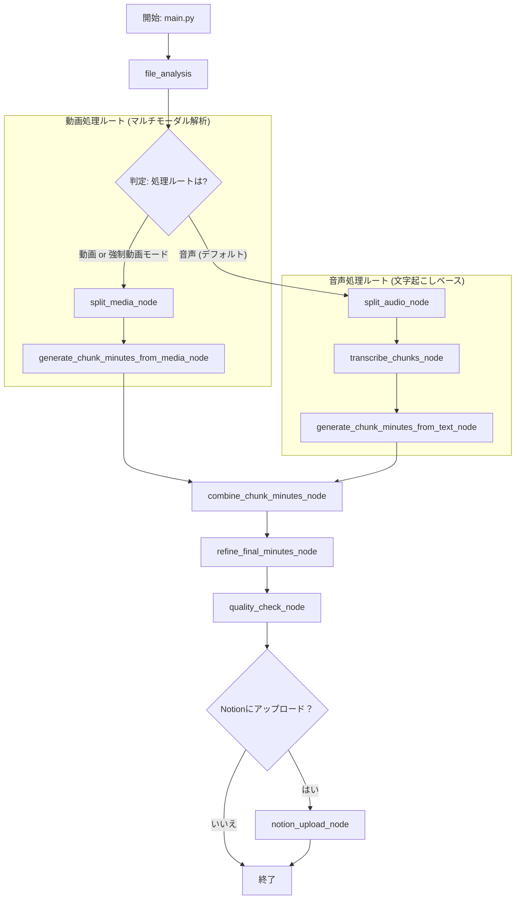

# 新機能設計書 (最終版): オプション選択式・段階的議事録生成ワークフロー

## 1. 目的

長時間のメディアファイルに対する議事録生成の精度と一貫性を向上させるとともに、ユーザーが**処理の柔軟性を確保**できるようにする。入力ファイルの種類（動画／音声）に応じて最適なルートをデフォルトで選択しつつ、ユーザーが必要に応じて**音声ファイルを意図的に動画処理ルート（マルチモーダル解析）で処理できるオプション**を提供する。

## 2. 変更概要

-   **コマンドラインオプションの追加:** `--force-video-mode` フラグを `main.py` に追加する。
-   **動的なワークフロー分岐:** `file_analysis` ノードの解析結果と、上記オプションの有無に基づいて、ワークフローを動的に分岐させる。
-   **Notionアップロード制御の厳密化:** ユーザーの意図とシステム設定の両方が有効な場合にのみアップロードを実行するロジックを `main.py` に実装する。

## 3. 新しいワークフロー



## 4. 状態 (`STTState`) の変更

```python
class STTState(TypedDict):
    # ... 既存のフィールド ...

    # ユーザーオプションを保持するフラグ
    force_video_mode: bool

    # 分割されたメディアチャンクのパスリスト
    media_chunks: Optional[List[str]]

    # 音声ルートでのみ使用
    chunk_transcriptions: Optional[List[str]]

    # 両ルートで生成され、結合される
    chunk_minutes: Optional[List[str]]

    # 結合された中間議事録
    combined_minutes_text: Optional[str]

    # ... 既存のフィールド ...
```

## 5. ノード詳細

（変更なし）

## 6. プロンプト設計

（変更なし）

## 7. 実装計画

### 7.1. CLIおよび事前処理 (`src/main.py`)

1.  **`--force-video-mode` 引数の追加:**
    -   `argparse` に `action='store_true'` で `--force-video-mode` を追加する。
    -   このフラグの値を、ワークフローの初期状態 `STTState` の `force_video_mode` フィールドに渡す。

2.  **`--upload-notion` 引数の変更:**
    -   `action` を `argparse.BooleanOptionalAction` に変更し、`default=True` を設定する。
    -   これにより、`--upload-notion` がデフォルトで有効となり、`--no-upload-notion` で無効化できる。

3.  **Notionアップロード可否の最終判断ロジック:**
    -   ワークフロー実行前に、以下のロジックで最終的なアップロード有無を判断する変数 `should_upload_to_notion` を設定する。
        ```python
        # デフォルトはコマンドライン引数に従う
        upload_enabled_by_user = args.upload_notion

        # 設定ファイル・環境変数からNotionのデータベースIDを取得
        notion_db_id = config.get("notion_database_id")

        # 最終的なアップロードフラグを決定
        should_upload_to_notion = upload_enabled_by_user and bool(notion_db_id)

        # ユーザーがアップロードを意図していたのにIDがない場合は通知
        if upload_enabled_by_user and not bool(notion_db_id):
            print("情報: NotionデータベースIDが設定されていないため、Notionへのアップロードはスキップされます。")
        ```
    -   `execute_stt_workflow` や `execute_batch_processing` を呼び出す際には、この `should_upload_to_notion` 変数を渡す。

### 7.2. 状態管理 (`src/workflows/state.py`)

1.  `STTState` に、セクション4で定義された新しいフィールド (`force_video_mode`, `media_chunks` など) を追加する。
2.  `create_initial_state` 関数に `force_video_mode: bool = False` を引数として追加し、各フィールドを適切に初期化するロジックを追記する。

### 7.3. ワークフロー (`src/workflows/stt_workflow.py`)

1.  **ルーティングロジックの更新:**
    -   `file_analysis` ノードの後の条件分岐エッジを、`state.file_type` と `state.force_video_mode` の両方を考慮するように変更する。
        -   `state.file_type == 'video'` または `state.force_video_mode == True` の場合は、動画処理ルートへ。
        -   それ以外の場合は、音声処理ルートへ。

### 7.4. 新規ノードおよびリファクタリング

1.  **新規ノード作成:**
    *   `src/workflows/nodes/split_media.py`
    *   `src/workflows/nodes/generate_chunk_minutes_from_media.py`
    *   `src/workflows/nodes/generate_chunk_minutes_from_text.py`
2.  **既存ノードのリファクタリング:**
    *   責務が変更になるノードの名称や入出力を設計に合わせて修正する。

### 7.5. テスト

1.  以下の全パターンについて、単体テストおよび結合テストを作成する。
    *   動画ファイルの処理
    *   音声ファイルのデフォルト処理（音声ルート）
    *   音声ファイルの `--force-video-mode` 指定処理（動画ルート）
    *   Notionアップロードが正しく実行／スキップされるかのテスト。