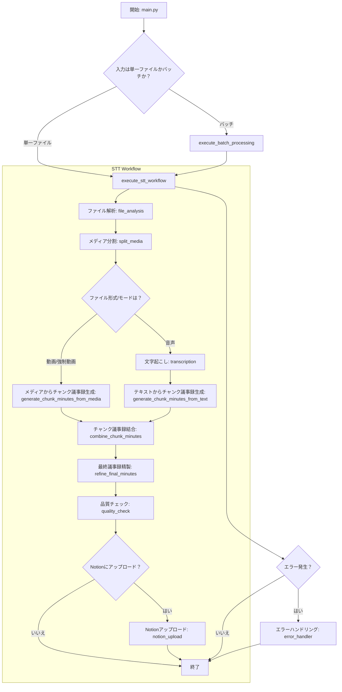

# プロジェクトドキュメント

## 1. 概要

このプロジェクトは、音声・動画ファイルから自動で文字起こしを行い、議事録を生成するシステムです。`LangGraph` を利用して、処理のフローを柔軟かつ堅牢に管理しています。

## 2. 処理フローチャート

## 3. 主要モジュールとクラスの機能概要

### 3.1. `src/main.py`

-   **役割:** アプリケーションのエントリーポイント。コマンドライン引数を解析し、ワークフローを開始します。
-   **主要関数:**
    -   `main()`: 引数を処理し、`execute_stt_workflow` または `execute_batch_processing` を呼び出します。
    -   `load_config()`: `settings.json` や環境変数から設定を読み込みます。
    -   `find_media_files()`: 指定されたパスから処理対象のメディアファイルを検索します。
    -   `print_result_summary()`: 処理結果のサマリーをコンソールに表示します。
    -   `save_results()`: 処理結果（議事録、文字起こしテキストなど）をファイルに保存します。

### 3.2. `src/workflows/stt_workflow.py`

-   **役割:** `LangGraph` を使用して、STT（Speech-to-Text）処理のワークフローを定義・実行します。
-   **主要関数:**
    -   `create_stt_workflow()`: ワークフローのグラフを構築します。各ノードと、それらの間の遷移条件（エッジ）を定義します。
    -   `execute_stt_workflow()`: 単一のファイルに対してSTTワークフローを実行します。
    -   `execute_batch_processing()`: 複数のファイルを並列で処理します。
    -   `route_after_*()`: 各ノードの処理結果に基づき、次に実行するノードを決定するルーティング関数群です。

### 3.3. `src/workflows/nodes/`

このディレクトリには、ワークフローを構成する個々の処理ノードが含まれています。各ノードは `STTState` オブジェクトを受け取り、処理結果で状態を更新して返します。

-   `analyze_file_node`: 入力ファイルの形式（動画/音声）、MIMEタイプ、メディア情報を解析します。
-   `split_media_node`: 長いメディアファイル（動画/音声）を、後続の処理（文字起こし、チャンク議事録生成）に適した短いチャンクに分割します。必要に応じて動画から音声を抽出します。
-   `transcribe_node`: 音声チャンクまたは音声ファイルをGemini APIに送信し、文字起こしを実行します。
-   `generate_chunk_minutes_from_media_node`: 動画ファイルから抽出した情報（例: 場面転換、話者情報）と文字起こし結果を基に、チャンクごとの議事録を生成します。
-   `generate_chunk_minutes_from_text_node`: 文字起こし結果のみを基に、チャンクごとの議事録を生成します。
-   `combine_chunk_minutes_node`: 生成された複数のチャンク議事録を結合し、一つのまとまった議事録を作成します。
-   `refine_final_minutes_node`: 結合された議事録を最終的に精製し、体裁を整えたり、冗長な表現を修正したりします。
-   `quality_check_node`: 文字起こし結果および生成された議事録の品質を評価します（例：誤字脱字、ハルシネーションのチェック）。
-   `upload_notion_node`: 生成された議事録をNotionの指定されたデータベースにアップロードします。
-   `error_handler_node`: ワークフロー実行中に発生したエラーを処理し、適切なログ記録と状態更新を行います。

### 3.4. `src/core/`

-   **役割:** 外部サービスとの連携や、中核となるビジネスロジックを実装します。
-   **主要クラス:**
    -   `GeminiService`: Google Gemini APIとの通信を担当します。テキスト生成や音声の文字起こし機能を提供します。
    -   `NotionClient`: Notion APIを操作し、ページの作成や更新を行います。
    -   `AudioProcessor`: `pydub` を使用して、音声ファイルの分割や情報取得などの処理を行います。
    -   `VideoProcessor`: `ffmpeg-python` を使用して、動画ファイルからの音声抽出や情報取得を行います。

### 3.5. `src/utils/`

-   **役割:** プロジェクト全体で利用される補助的な機能を提供します。
-   **主要モジュール:**
    -   `logging_config.py`: アプリケーションのロギング設定を行います。
    -   `retry_utils.py`: API呼び出し失敗時に自動で再試行するためのデコレータを提供します。
    -   `prompt_loader.py`: `prompts/` ディレクトリからプロンプトテンプレートを読み込みます。
    -   `performance_monitor.py`: 各処理ステップの実行時間を計測するための機能を提供します。

## 4. 状態管理 (`src/workflows/state.py`)

ワークフロー全体の状態は `STTState` という `TypedDict` で管理されます。このオブジェクトがグラフ内を流れ、各ノードで情報が追加・更新されていきます。

-   **`STTState` の主な内容:**
    -   `session_id`: 処理ごとに一意なID。
    -   `file_path`, `original_filename`: 入力ファイルの情報。
    -   `settings`: 実行時の設定。
    -   `file_type`, `audio_duration`: ファイル解析結果。
    -   `chunks`: 分割された音声ファイルのパスリスト。
    -   `transcription`: 文字起こし結果のテキスト。
    -   `minutes`: 生成された議事録のテキスト。
    -   `notion_page_id`: Notionにアップロードされた場合のページID。
    -   `errors`, `warnings`: 処理中に発生したエラーや警告のリスト。
    -   `final_status`: 最終的な処理結果（"success", "error"など）。
