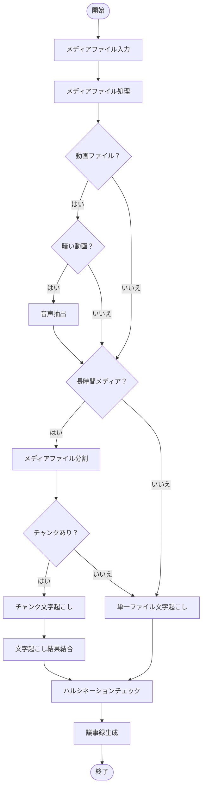
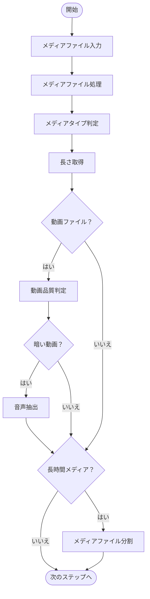
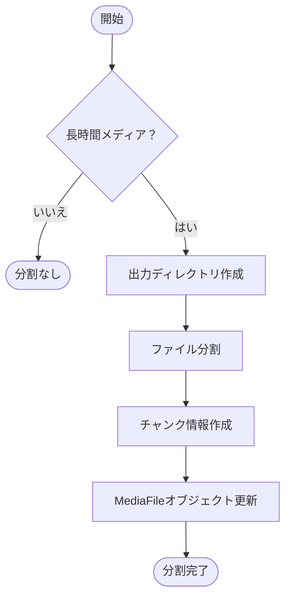
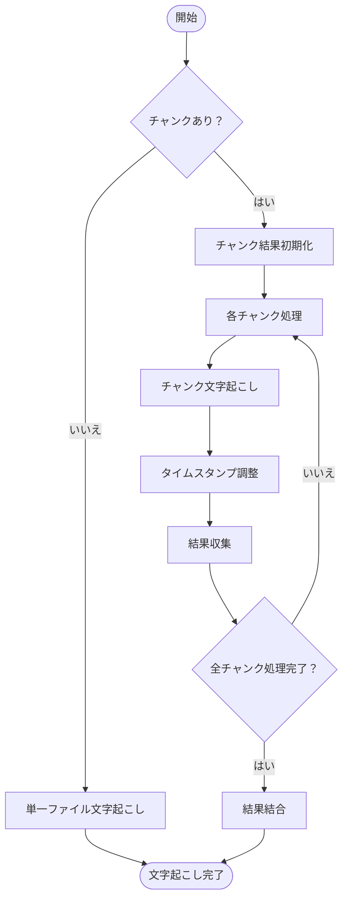
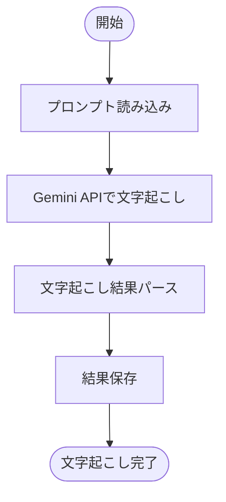
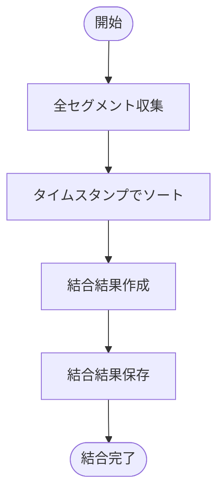
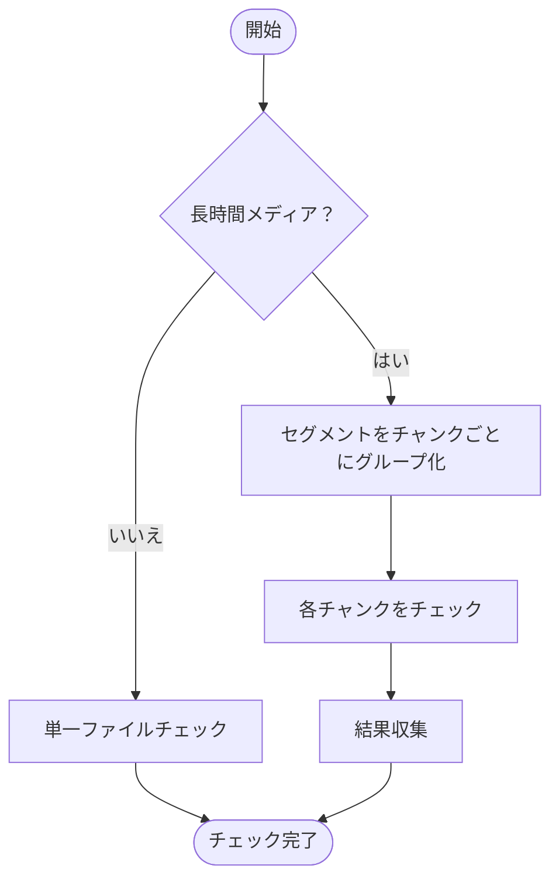
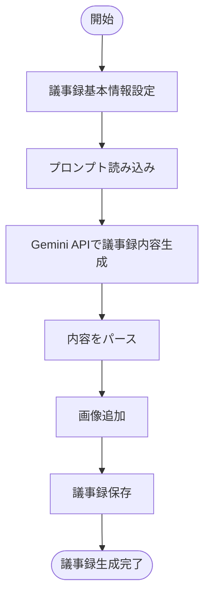

# 文字お越しのフローチャート

このドキュメントは、現在の文字お越し（文字起こし）システムのワークフローを図解したものです。

## 全体的なフロー

## 詳細なフロー

### 1. メディアファイル処理

### 2. メディアファイル分割

### 3. 文字起こしプロセス

### 4. 単一ファイル文字起こし

### 5. 文字起こし結果結合

### 6. ハルシネーションチェック

### 7. 議事録生成

## 全体的なワークフロー

1. **メディアファイル処理**:
   - メディアファイルを入力として受け取る
   - メディアタイプ（音声/動画）を判定
   - ファイルの長さを取得
   - 動画の場合は品質を判定

2. **前処理**:
   - 暗い動画の場合は音声を抽出
   - 長時間メディア（40分以上）の場合はチャンクに分割

3. **文字起こし**:
   - チャンクがある場合は各チャンクを個別に文字起こし
   - チャンクがない場合は単一ファイルとして文字起こし
   - チャンクの文字起こし結果を結合（元のメディアファイルのパスを使用）

4. **ハルシネーションチェック**:
   - 文字起こし結果のハルシネーション（幻覚）をチェック
   - 重大度に応じて結果を分類

5. **議事録生成**:
   - 文字起こし結果から議事録の基本情報を設定
   - Gemini APIを使用して議事録内容を生成
   - 画像がある場合は追加
   - 議事録を保存

6. **出力**:
   - 生成された議事録をMarkdown形式で出力